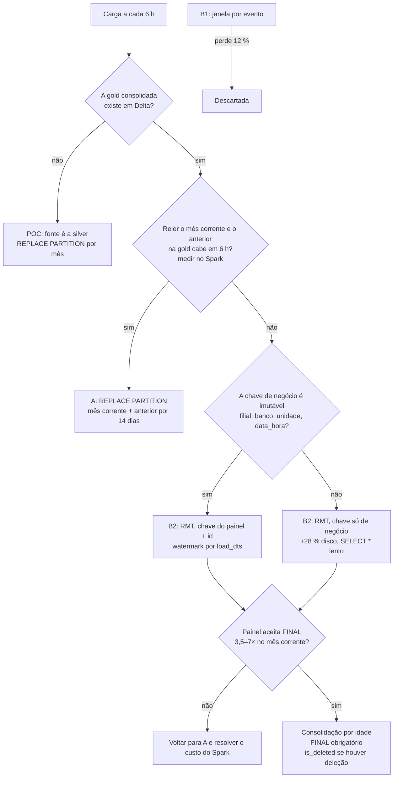

# Estratégia de carga no ClickHouse: `REPLACE PARTITION` × `ReplacingMergeTree`

| Campo | Valor |
|---|---|
| Versão | 1.0 |
| Data | 2026-09-11 |
| Status | **Decidido em 2026-09-11** ([ADR-004](decisoes/ADR-004-janela-de-carga.md)): POC com A; produção futura com B2 |
| Escopo | Custo de escrita, custo de leitura e corretude dos dois métodos, no cenário da POC e no produtivo (gold em Delta, schedule de 6 h) |
| Stack alvo | ClickHouse 24.8.14 (Altinity operator, 1 réplica), Spark 3.5 + Delta, Airflow 2.11 |
| Alimenta | [ADR-004](decisoes/ADR-004-janela-de-carga.md) e [E3 T3.0](epicos/E3-validacao.md#t30--portão-de-janela) |

---

## Sumário

1. [Como usar este documento](#1-como-usar-este-documento)
2. [Glossário](#2-glossário)
3. [Problema, premissas e escopo](#3-problema-premissas-e-escopo)
4. [Fundamentos](#4-fundamentos)
5. [Ambiente e método de medição](#5-ambiente-e-método-de-medição)
6. [Custo de escrita](#6-custo-de-escrita)
7. [Custo de leitura — a seção mais importante](#7-custo-de-leitura--a-seção-mais-importante)
8. [Duplicatas que o merge não remove](#8-duplicatas-que-o-merge-não-remove)
9. [Atraso de chegada do dado](#9-atraso-de-chegada-do-dado)
10. [Projeção para o cenário produtivo](#10-projeção-para-o-cenário-produtivo)
11. [Cenário da POC](#11-cenário-da-poc)
12. [Recomendação](#12-recomendação)
13. [Fluxo de decisão](#13-fluxo-de-decisão)
14. [Diagnóstico em operação](#14-diagnóstico-em-operação)
15. [Riscos e limitações](#15-riscos-e-limitações)
16. [Checklists](#16-checklists)
17. [Alternativas](#17-alternativas)
18. [Anexos](#18-anexos)
19. [Resumo executivo](#19-resumo-executivo)
20. [Referências](#20-referências)

---

## 1. Como usar este documento

| Papel | Seções |
|---|---|
| Quem decide a estratégia produtiva | **§7**, §9, §10, §12 e §19 |
| Quem implementa a carga | §4, §8, §14, §16 e §18 |
| Quem conduz o benchmark (T3.2) | §7 e §11 — o método de carga muda o número de leitura |
| Quem revisa a POC | §5 e §15 |

**A seção mais importante é a [§7](#7-custo-de-leitura--a-seção-mais-importante).** A escolha entre os
dois métodos parece uma questão de custo de escrita, mas o que ela decide é o custo de **leitura** do
mês corrente, que é o mês que o painel consulta.

---

## 2. Glossário

| Termo | Significado |
|---|---|
| `REPLACE PARTITION` | Comando do ClickHouse que substitui, de forma atômica, uma partição inteira da tabela de destino pelo conteúdo da mesma partição de outra tabela |
| Staging | Tabela intermediária com a mesma estrutura do destino, que recebe a carga antes da troca |
| `MergeTree` | Motor de tabela base do ClickHouse. Grava em *parts* imutáveis e as funde em segundo plano |
| `ReplacingMergeTree` (RMT) | Variante do `MergeTree` que, ao fundir parts, mantém uma única linha por valor da chave de ordenação — a de maior versão |
| Part | Arquivo imutável de dados, ordenado pela chave de ordenação. Cada `INSERT` cria ao menos uma |
| Merge | Fusão de parts em segundo plano. No RMT é o momento em que duplicatas são removidas |
| `FINAL` | Modificador de `SELECT` que aplica, na hora da leitura, a deduplicação que o merge ainda não fez |
| `OPTIMIZE ... FINAL` | Força o merge de todas as parts de uma partição numa só |
| Chave de ordenação (`ORDER BY`) | Colunas pelas quais as linhas são ordenadas no disco. No RMT, é também a identidade da linha |
| Faixas sobrepostas | Trechos da chave de ordenação presentes em mais de uma part. É onde o `FINAL` precisa trabalhar |
| Gold | Camada de dado consolidado em Delta Lake, de onde o datamart seria copiado em produção |
| Silver | Camada de dado limpo, anterior à gold. É de onde a POC carrega hoje |
| `load_dts` | Instante de ingestão da linha na camada. Na silver, é preservado por linha |
| `data_hora` / `timestamp` | Instante do evento (data da pesagem). É a coluna de partição do datamart |
| Atraso de chegada | `load_dts − data_hora`: quanto tempo a linha leva para aparecer na camada depois do evento |
| Watermark | Marca do último `load_dts` já carregado. A próxima execução lê só o que chegou depois dela |
| Janela por evento | Filtro "últimos N dias de `data_hora`". É o que a proposta de 6 h com margem usa |
| p50, p99, p999 | Percentis: o valor abaixo do qual estão 50 %, 99 % e 99,9 % das observações |

---

## 3. Problema, premissas e escopo

### O problema

O datamart ClickHouse precisa receber dado novo e dado corrigido sem duplicar nem perder linha, e sem
degradar a leitura, que é a razão de ele existir. Há duas estratégias candidatas:

| Estratégia | Como carrega | Quem remove duplicata |
|---|---|---|
| **A — `REPLACE PARTITION`** | Reescreve o mês inteiro a cada execução, a partir de uma fonte consolidada | Ninguém: a partição nova substitui a velha |
| **B — `ReplacingMergeTree`** | Insere só o recorte recente a cada execução | O merge em segundo plano, e o `FINAL` na leitura enquanto o merge não acontece |

Uma solução é aceitável se: (1) nenhuma linha é perdida nem contada duas vezes pelo painel; (2) a
leitura do mês corrente não se degrada a ponto de anular o ganho sobre o Postgres; (3) o custo de
escrita cabe no intervalo de 6 h.

### Premissas

1. **Volume de referência:** o tenant medido na POC. Pico de 3,48 M de linhas por mês (2026-08),
   cerca de 112 mil por dia e 28 mil a cada 6 h. Produção terá vários tenants desse porte; a
   quantidade não foi informada.
2. **Em produção existe a gold em Delta**, particionada por mês e consolidada antes da cópia. Na POC
   não existe: a fonte é a silver.
3. **Schedule de 6 h**, 4 execuções por dia, cerca de 120 por mês.
4. **O atraso medido na silver vale para a gold.** A gold é derivada da silver, então herda pelo menos
   o mesmo atraso.
5. **`load_dts` da silver reflete a chegada ou a última atualização da linha.** Nos dois casos, o mês
   daquela linha precisa ser recarregado.
6. **As colunas `filial`, `banco`, `unidade_producao_id` e `data_hora` de uma linha não mudam depois
   de gravadas.** É premissa para a variante de RMT com chave do painel. Não foi verificada na origem.

### Fora de escopo

- Custo do lado Spark em produção: leitura da gold e envio pelo connector. Não há gold na POC para medir.
- Réplicas e ClickHouse Keeper: a POC tem 1 réplica. `REPLACE PARTITION` e merges em tabela replicada
  têm custo de coordenação que não aparece aqui.
- O braço Postgres. O merge dele sobre dado existente foi medido à parte em
  [TESTES §6.2](TESTES.md#62-recarga-sobre-dado-existente--o-custo-do-merge).
- *Lightweight updates* e o motor de updates em patch parts do ClickHouse 25.x, que não existem na 24.8.

---

## 4. Fundamentos

### `REPLACE PARTITION`

A carga grava a fatia completa do mês numa staging e troca a partição do destino em uma operação. Pela
documentação oficial, a troca é **atômica** e exige que as duas tabelas tenham a mesma estrutura, a mesma
chave de partição, de ordenação e primária, e a mesma política de armazenamento. A troca é operação de
metadados sobre as parts: não copia dado.

Propriedade que importa: **o destino nunca tem duplicata**, e uma linha apagada na origem some do destino
na próxima troca. O preço é reescrever o mês inteiro, mesmo quando só uma linha mudou.

### `ReplacingMergeTree`

A carga insere as linhas novas e as corrigidas como parts novas. Linhas com a **mesma chave de
ordenação, dentro da mesma partição**, são colapsadas no merge, mantendo a de maior versão (`load_dts`).

Três consequências, todas da documentação oficial:

1. **A deduplicação é eventual.** Entre o `INSERT` e o merge, o `SELECT` comum devolve duplicatas.
2. **A chave de ordenação é a identidade da linha.** Se uma coluna da chave mudar de valor, a linha nova
   é tratada como outra entidade, e a antiga nunca some. A documentação exige colunas imutáveis na chave.
3. **Deduplica só dentro da partição.** Se a coluna de partição de uma linha mudar, as duas versões ficam
   em partições diferentes para sempre.

### `FINAL` e o que o torna caro

O `FINAL` aplica na leitura a deduplicação pendente. Desde a 23.12, o ClickHouse divide as faixas de
dados em **não sobrepostas**, lidas como se não houvesse `FINAL`, e **sobrepostas**, que precisam ser
fundidas na hora. Por isso o custo do `FINAL` não depende de haver duplicatas: depende de haver
**parts sobrepostas**. Com uma part por partição, o `FINAL` custa o mesmo que uma leitura comum (§7).

O `FINAL` também lê todas as colunas da chave de ordenação, mesmo as que a query não pede.

---

## 5. Ambiente e método de medição

| Item | Valor |
|---|---|
| Servidor | ClickHouse 24.8.14.39, 1 réplica, `max_server_memory_usage` 2 GiB, `max_threads` 3 |
| Merge | `background_pool_size` 8, `do_not_merge_across_partitions_select_final` = 1 no perfil |
| Dado | `dm_acme.fact_200_cep`: 7 114 401 linhas, 2026-07 a 2026-09, 5 filiais |
| Local | database `bench_carga`, criado para isto; `dm_acme` não foi alterado |
| Leitura | cada query 7 vezes, mediana das 5 últimas, cache quente; linhas e bytes de `SelectedRows`/`SelectedBytes` |

Quatro tabelas, com o mesmo dado e as mesmas colunas:

| Tabela | Motor | Chave de ordenação | Papel |
|---|---|---|---|
| `fato_rp` | `MergeTree` | `(filial, banco, unidade_producao_id, timestamp)` | Estratégia A, igual à POC |
| `fato_rmt_dash` | RMT(`load_dts`) | a mesma + `hk_business_id` | B com chave boa para o painel; exige a premissa 6 |
| `fato_rmt_id` | RMT(`load_dts`) | a mesma + `andon_peso_id` (inteiro) | Idem, com identidade de 8 bytes em vez de 64 |
| `fato_rmt_pk` | RMT(`load_dts`) | `(filial, banco, hk_business_id)` | B sem depender da premissa 6: só colunas da chave de negócio |

As três queries imitam o benchmark da T3.2:

| Query | O que faz |
|---|---|
| `painel` | 1 filial, 1 banco, 1 mês; agrupa por dia e unidade de produção |
| `mensal` | 3 meses, todas as filiais; `count` e `sum(valor)` por filial e mês |
| `estrela` | `SELECT *` de 1 filial, 1 semana |

A DDL e o script de medição estão nos [anexos](#18-anexos).

---

## 6. Custo de escrita

### Medido, do lado do ClickHouse

`INSERT ... SELECT` a partir de `dm_acme`, sem Spark e sem rede. Mede o custo do motor, não o da
pipeline inteira.

| Operação | Linhas | Tempo |
|---|---:|---:|
| **A** — staging do mês de pico (2026-08), 3 repetições | 3 477 664 | 3,05 – 3,31 s |
| **A** — troca da partição de 2026-08 | — | 11 – 37 ms |
| **A** — staging de 2026-09, 3 repetições | 1 039 682 | 1,03 – 1,12 s |
| **A** — troca da partição de 2026-09 | — | 4 – 6 ms |
| **B** — `INSERT` de uma janela de 3 dias, 4 execuções × 3 variantes | 281 052 | 0,28 – 0,80 s |
| **B** — `OPTIMIZE ... PARTITION 202608 FINAL` | 3 477 664 | 2,15 – 3,73 s |
| Carga inicial das 7,1 M linhas | 7 114 401 | 8,6 – 15,4 s |

A escreve a ~1,1 M de linhas por segundo, e a troca é instantânea. B insere 12 vezes menos por
execução, mas **o custo de reescrever o mês não desaparece: ele é adiado para o merge**. Consolidar
agosto custou de 2,2 a 3,7 s, a mesma ordem da staging de A.

### Medido, na pipeline da POC

A pipeline Spark da POC, com a silver como fonte, gastou 120 a 138 s na staging do ClickHouse para
1,04 M de linhas ([TESTES §6.2](TESTES.md#62-recarga-sobre-dado-existente--o-custo-do-merge)). O número
inclui recomputar a junção da silver e não separa leitura de escrita. Serve para mostrar que **o custo
do ClickHouse é a menor parte da carga**: 1 s de motor dentro de 2 min de pipeline.

### Espaço em disco

| Tabela | Disco (3 meses) | Diferença |
|---|---:|---:|
| `fato_rp`, `fato_rmt_dash`, `fato_rmt_id` | 522 MiB | — |
| `fato_rmt_pk` | 670 MiB | **+28 %** |

Ordenar por um hash espalha valores parecidos e piora a compressão de todas as colunas.

---

## 7. Custo de leitura — a seção mais importante

Tempos em milissegundos, mediana. Entre parênteses, MiB lidos.

### Com a tabela limpa, sem nenhuma duplicata

Estado logo depois da carga inicial: de 2 a 7 parts por partição, merges assentados.

| Tabela | `painel` | `mensal` | `estrela` |
|---|---:|---:|---:|
| **A** — `fato_rp` | **55** (51) | **166** (88) | **100** (151) |
| B — `fato_rmt_dash` sem `FINAL` | 63 (52) | 209 (88) | 93 (156) |
| B — `fato_rmt_dash` com `FINAL` | 196 (248) | 621 (712) | 145 (186) |
| B — `fato_rmt_id` com `FINAL` | 250 (91) | 496 (265) | 164 (171) |
| B — `fato_rmt_pk` com `FINAL` | 385 (254) | 905 (664) | 1 058 (625) |

**Sem uma única duplicata, o `FINAL` custa de 1,5 a 11 vezes a leitura do `MergeTree`.** A chave inteira
(`fato_rmt_id`) lê 2,7 vezes menos bytes que a de hash, mas o tempo quase não cai: o custo é de CPU,
fundindo faixas sobrepostas, e não de I/O.

### Depois de 4 execuções de 6 h (um dia), antes de qualquer consolidação

| Tabela | `painel` | `mensal` | `estrela` |
|---|---:|---:|---:|
| B — `fato_rmt_dash` sem `FINAL` | 62 — **resultado errado** | 202 — **errado** | 202 — **errado** |
| B — `fato_rmt_dash` com `FINAL` | 312 | 836 | 201 |
| B — `fato_rmt_id` com `FINAL` | 223 | 534 | 223 |
| B — `fato_rmt_pk` com `FINAL` | 234 | 741 | 495 |

Sem `FINAL`, o painel leu 2 782 689 linhas de um recorte que tem 2 447 664, ou seja, 14 % a mais. As
duplicatas entram no `count()` e na média, e nada acusa erro.

### Depois de consolidar, uma part por partição

| Tabela | `painel` | `mensal` | `estrela` |
|---|---:|---:|---:|
| **A** — `fato_rp` | 79 | 185 | 101 |
| B — `fato_rmt_dash` com `FINAL` | **44** | **154** | **80** |
| B — `fato_rmt_id` com `FINAL` | 46 | 172 | 91 |

Com uma part por partição, o `FINAL` custa o mesmo que uma leitura comum: os bytes lidos na `mensal`
são idênticos (88 MiB). **O custo do `FINAL` vem das parts sobrepostas.** Quando só agosto estava
consolidado, a `painel` (que lê só agosto) já caiu para 43 ms, mas a `mensal` (que lê julho e setembro,
ainda com várias parts) seguiu em 861 ms.

### O que isto significa

> **A partição que recebe carga a cada 6 h é o mês corrente, e é ele que o painel consulta.** No RMT, é
> exatamente essa partição que vive com várias parts. O custo de 3,5 a 7 vezes no painel cai onde o usuário olha.
> As partições antigas podem ser consolidadas e ficam com leitura igual à do `MergeTree`.

A configuração `do_not_merge_across_partitions_select_final` não mudou o resultado de forma mensurável
aqui (medianas de 0,71 s com ela e 0,69 s sem). A otimização de partição da 23.12 só entra sozinha quando a
chave de partição é prefixo da chave de ordenação, o que não é o caso.

---

## 8. Duplicatas que o merge não remove

Depois das 4 execuções, os merges em segundo plano pararam, com duplicatas ainda na tabela:

| Tabela | Linhas físicas em 2026-08 | Linhas reais | Duplicatas |
|---|---:|---:|---:|
| `fato_rmt_dash` | 4 039 768 | 3 477 664 | 562 104 (16 %) |
| `fato_rmt_pk` | 3 758 716 | 3 477 664 | 281 052 (8 %) |
| `fato_rmt_id` | 4 320 820 | 3 477 664 | 843 156 (24 %) |

O ClickHouse escolhe as parts a fundir por tamanho, não por haver duplicata. Parts que não serão fundidas
tão cedo guardam duplicatas por tempo indeterminado. A documentação recomenda
`min_age_to_force_merge_seconds` bem menor que o período da partição, para que partições antigas acabem
numa part só, e desaconselha `OPTIMIZE FINAL` recorrente em tabela grande.

Consequência: **no RMT, toda query do painel precisa de `FINAL`**, ou de lógica equivalente (`argMax`,
`LIMIT 1 BY`), em qualquer ferramenta que leia a tabela. Uma consulta sem `FINAL` devolve um número
plausível e errado.

---

## 9. Atraso de chegada do dado

Medido na silver da v3321, nas 5 filiais, em linhas com `data_hora` a partir de 2026-03, quando a
ingestão já estava em regime: **9 714 305 linhas**. Atraso = `load_dts − data_hora`.

| Filial | Linhas | > 6 h | > 24 h | > 3 dias | > 7 dias | > 14 dias | p50 | p99 | p999 |
|---|---:|---:|---:|---:|---:|---:|---:|---:|---:|
| limeira | 6 122 248 | 71,0 % | 29,1 % | 12,4 % | 3,7 % | 0 % | 7,9 h | 212 h | 237 h |
| maracanau | 1 381 721 | 74,2 % | 24,4 % | 13,5 % | 4,2 % | 0,075 % | 8,2 h | 219 h | 286 h |
| paulinia | 1 720 833 | 71,7 % | 21,0 % | 11,2 % | 3,4 % | 0,016 % | 7,8 h | 208 h | 223 h |
| pompeia | 85 970 | 89,3 % | 29,4 % | 14,8 % | 5,4 % | 0,188 % | 10,8 h | 297 h | 384 h |
| uberaba | 403 533 | 68,8 % | 17,4 % | 9,8 % | 4,9 % | 0,024 % | 7,5 h | 300 h | 322 h |
| **Total** | **9 714 305** | **71,6 %** | **26,5 %** | **12,3 %** | **3,8 %** | **0,016 %** | **7,9 h** | **213 h** | **287 h** |

### Este é o modo de falha dominante

Uma janela por evento, "últimos N dias de `data_hora`", captura uma linha só se ela chegar em até N
dias. Toda linha mais atrasada **nunca** é carregada, e nada acusa:

| Janela por evento | Linhas perdidas para sempre | Linhas reenviadas por execução, no pico |
|---|---:|---:|
| 3 dias | **12,3 %** | ~280 a 340 mil |
| 7 dias | 3,8 % | ~785 mil |
| 14 dias | 0,016 % | ~1,6 M — 45 % do mês, a cada 6 h |

A margem que cobre o atraso real reenvia quase meio mês a cada execução, e o ganho de volume do RMT
desaparece. A saída é trocar o critério: **watermark por `load_dts`**. Cada execução lê o que chegou
desde a anterior, mais uma sobreposição para o descasamento dos replicadores. Toda linha atrasada chega
com `load_dts` novo, então nenhuma se perde, qualquer que seja o atraso, e o volume por execução fica
em ~84 mil linhas no pico (6 h mais 12 h de sobreposição).

O mesmo dado dimensiona a estratégia A: um mês continua recebendo linhas por **até 14 dias** depois de
fechado. A carga precisa trocar o mês corrente **e o anterior** nesse período.

---

## 10. Projeção para o cenário produtivo

Por tenant do porte da POC, com gold em Delta e schedule de 6 h. Tempos de ClickHouse extrapolados
linearmente de §6 (~1,1 M linhas/s, 1 nó, 3 threads). **O custo Spark não entra: não foi medido.**

| | **A — `REPLACE` do mês corrente e do anterior** | **B1 — RMT, janela por evento de 3 dias** | **B2 — RMT, watermark por `load_dts`** |
|---|---|---|---|
| Linhas enviadas por execução, pico | 3,5 M no fim do mês; até ~5 M nos 14 primeiros dias | ~280 a 340 mil | ~84 mil |
| Linhas escritas por mês | ~400 M (~115 × o mês) | ~40 M | ~10 M, mais a reescrita dos merges |
| ClickHouse por execução, pior caso | ~3 a 4,6 s | < 1 s | < 0,1 s |
| Consolidação | Não precisa | Precisa (`OPTIMIZE` ~3 s por mês fechado) | Idem |
| Linhas perdidas por atraso | 0 (com o mês anterior) | **12,3 %** | 0 |
| Leitura do mês corrente | Igual ao `MergeTree` | 3,5 a 7 × mais lenta no painel, só com `FINAL` | Idem |
| Leitura de meses fechados | Igual ao `MergeTree` | Igual, se consolidados | Idem |
| Linha apagada na origem | Some na próxima troca | Fica para sempre, sem coluna `is_deleted` e sinal da origem | Idem |
| Consulta sem `FINAL` | Correta | **Errada** | **Errada** |
| Dependência de chave imutável | Não | Sim | Sim |

Leitura da tabela:

- **A é cara em volume, barata em motor.** Reescreve 115 vezes o mês por mês, mas no ClickHouse isso
  são segundos por execução. O custo real mora no Spark, que relê a fatia do mês na gold 4 vezes por
  dia. Com a gold particionada por mês, é uma varredura limitada, mas é o número que falta medir.
- **B1 é descartável.** Perde 12 % das linhas em silêncio. Aumentar a janela até não perder recria o
  volume de A e mantém o custo de leitura de B.
- **B2 é a forma correta do RMT.** Escreve pouco, não perde nada, e paga na leitura do mês corrente.

### Onde A deixa de caber

O motor escala linear. Estimativa por execução, só ClickHouse, com o mês anterior incluído:

| Linhas por mês, por tenant | ClickHouse por execução | Leitura da gold por execução, Spark |
|---|---:|---|
| 3,5 M (POC) | ~3 – 5 s | não medida |
| 35 M | ~30 – 50 s | não medida |
| 350 M | ~5 – 8 min | provavelmente o limite |

Na faixa de dezenas de milhões de linhas por mês por tenant, A continua dentro das 6 h com folga do
lado do ClickHouse. O limite provável é o Spark relendo a gold, e ele precisa ser medido antes de
descartar A por volume.

---

## 11. Cenário da POC

A POC carrega cada mês uma vez, de um snapshot parado. Nesse cenário:

| | A — `REPLACE PARTITION` | B — RMT |
|---|---|---|
| Corretude | Idempotente, provada sobre dado real ([TESTES §6.2](TESTES.md#62-recarga-sobre-dado-existente--o-custo-do-merge)) | Idem, com `FINAL` |
| Leitura no benchmark | Sem `FINAL`, sem ruído | Depende de quantas parts sobraram da carga |
| Custo de carga | ~1 s de motor por mês | Parecido |

**Para a POC, A é a escolha certa**, e é o que está implementado. O benchmark da T3.2 mede o motor lendo
uma tabela limpa.

> **O número da T3.2 depende do método de carga.** Se produção for de RMT, medir a POC só com
> `MergeTree` superestima o ClickHouse em 3,5 a 7 vezes nas consultas do mês corrente. Nesse caso, a T3.2
> precisa de um braço RMT com `FINAL` e com o número de parts de um dia real de carga. §7 mostra como
> reproduzir esse estado.

---

## 12. Recomendação

Julgamento de engenharia, a partir das medições acima:

1. **Na POC, manter A.** Nenhuma mudança de código.
2. **Em produção, com a gold consolidada em Delta, preferir A**, trocando o mês corrente **e o
   anterior** enquanto o anterior ainda recebe dado (14 dias cobrem 99,98 % das linhas medidas). É o que
   dá leitura sem `FINAL`, deleção propagada e nenhuma dependência de chave imutável. O custo está no
   Spark, e precisa ser medido com a gold real antes de ser aceito.
3. **Se o volume por tenant tornar inviável reler o mês a cada 6 h, usar B2**, nunca B1:
   - watermark por `load_dts` da gold, com sobreposição para os replicadores;
   - chave de ordenação só com colunas imutáveis. `fato_rmt_id` é o melhor compromisso medido, se a
     premissa 6 se confirmar; senão, `fato_rmt_pk`, com +28 % de disco e `SELECT *` 3 a 10 vezes mais
     lento;
   - `min_age_to_force_merge_seconds` e `min_age_to_force_merge_on_partition_only` para consolidar os
     meses fechados;
   - `FINAL` obrigatório em toda query, com o custo de 3,5 a 7 vezes no mês corrente assumido e medido
     na T3.2;
   - coluna `is_deleted` se a origem apagar linhas.
4. **Registrar a decisão no ADR-004** com os números de §7, §9 e §10.

**Decisão do usuário (2026-09-11):** a POC fica com A; produção terá B2. Registrada no
[ADR-004](decisoes/ADR-004-janela-de-carga.md).

### Custo de implementação de B2

Estimativa de engenharia sobre o código da POC, não medição. Soma de **5 a 8 dias**, sem contar os dois
itens que dependem da gold.

| # | Componente | Arquivo | O que muda | Esforço |
|---|---|---|---|---|
| 1 | DDL | `ddl/clickhouse/01_fact_200_cep.sql` | `ReplacingMergeTree(versão)`, chave com `andon_peso_id` não nulo, consolidação por idade | 0,5 d |
| 2 | Coluna de versão | DDL, query, escritor | `load_dts` **da origem** como versão e como rastro do watermark | 0,5 d |
| 3 | Escritor | `repository.py`, `clickhouse_datamart.py` | Staging, guarda de cobertura mensal e `REPLACE PARTITION` viram `append` — o código encolhe | 0,5 d |
| 4 | Testes de integração | `test_repository_datamart_clickhouse.py` | Os 6 casos de troca de partição dão lugar a: recarga sob `FINAL`, linha atrasada em mês fechado, versão mais nova vence | 1 d |
| 5 | Query | `fact_200_cep.sql` | Predicado por `load_dts` no lugar de `data_hora` | 0,5 d |
| 6 | DAG | `datamart_dag.py`, seed do Mongo | Janela do intervalo menos a margem; agenda de 6 h; catchup | 0,5 a 1 d |
| 7 | Acesso | `ddl/rbac/10_tenant.sql.tpl` | `final = 1` travado no perfil do leitor; loader perde `ALTER MOVE PARTITION`, `ALTER DELETE`, `DROP TABLE` | 0,25 d |
| 8 | Operação | TROUBLESHOOTING, alertas | Duplicata em mês fechado, parts por partição, merge preso | 1 d |
| 9 | Validação | T3.2 | Braço RMT com as parts de um dia real | 1 a 2 d |
| 10 | Documentação | ADR-002, E2, E3 | Troca de motor | 0,5 d |

**O que barateia:** a configuração `final = 1` no perfil do leitor aplica o `FINAL` sozinha e é
ignorada em tabelas que não o suportam. Verificado na 24.8: `MergeTree` com a configuração devolve o
resultado normal; RMT com 990 duplicatas devolve 1 040 672 sem ela e 1 039 682 com ela; a junção dos
dois também sai correta. **Nenhuma query de painel muda.**

**O que pode encarecer:**

- **Watermark e dimensões.** A fato junta 4 tabelas. Um `load_dts` só da tabela de pesagens não vê
  mudança numa dimensão. Em produção se resolve se a gold da fato tiver o próprio `load_dts`, renovado
  sempre que a linha for recalculada — é contrato a fechar com o desenho da gold.
- **Execuções sem buraco.** Janela por intervalo exige `catchup=True`. Com o `start_date` atual
  (2025-01-01) e agenda de 6 h, o Airflow criaria ~2 500 execuções ao despausar: o `start_date` tem de
  ser a data de entrada em produção.
- **Deleções.** Se a origem apaga linhas, exige `is_deleted` e a gold emitindo a deleção. Custa zero se
  a origem nunca apaga; pode ser o item mais caro se apagar.
- **Migração.** Trocar o motor exige recriar e recarregar. Sem janela de manutenção: carga numa tabela
  paralela e `EXCHANGE TABLES`. O ClickHouse recarregou 7 M de linhas em 10 a 15 s; o Spark não foi medido.

Para comparação, A em produção custaria de 1 a 2 dias: o escritor atual já troca várias partições, e a
DAG só precisa pedir o mês corrente e o anterior.

---

## 13. Fluxo de decisão



---

## 14. Diagnóstico em operação

| Sintoma | Causa provável | Investigação |
|---|---|---|
| Painel com número maior que o Postgres, sem erro | RMT lido sem `FINAL` | `SELECT count(), uniqExact(hk_business_id) FROM t WHERE toYYYYMM(timestamp) = :mes` — diferença é duplicata |
| Duplicata que não some nunca | Coluna da chave de ordenação ou da partição mudou na origem | Mesmo `hk_business_id` com `timestamp` ou `unidade_producao_id` diferentes |
| Painel lento só no mês corrente | Muitas parts sobrepostas na partição corrente | `SELECT partition, count() FROM system.parts WHERE active AND table = 't' GROUP BY partition` |
| Mês fechado perdendo linhas em relação à origem | Janela por evento menor que o atraso | Distribuição de `load_dts − data_hora` (§9, [anexo D](#anexo-d--atraso-de-chegada)) |
| Contagem de um mês cai depois de uma carga | `REPLACE` com fatia parcial | A guarda de cobertura da T2.3 deveria recusar; conferir a janela resolvida no log |
| Linha apagada na origem continua no painel | RMT sem `is_deleted` | Comparar chaves do destino com a gold |

---

## 15. Riscos e limitações

| Risco | Natureza | Mitigação |
|---|---|---|
| Custo Spark de A não medido | Lacuna de medição: sem gold na POC | Medir leitura do mês na gold real antes de decidir |
| 1 réplica, sem Keeper | Ambiente | Troca de partição e merge em tabela replicada custam coordenação; medir em produção |
| Cache quente | Método | As razões entre motores valem; os tempos absolutos, não |
| Premissa 6 não verificada | Dado | Consultar a origem: `data_hora` e `unidade_producao_id` são corrigidos depois de gravados? |
| `load_dts` pode ser atualização, não chegada | Dado | Não muda a conclusão: nos dois casos o mês precisa ser recarregado |
| Um tenant medido | Volume | §10 é extrapolação linear |
| Estado das parts depende do histórico de inserts | Método | §7 mostra três estados; produção terá o seu, e ele precisa ser medido |

### O que isto NÃO prova

- **Que A cabe em produção.** Prova que o ClickHouse aguenta; o Spark relendo a gold não foi medido.
- **Que B2 custa 3,5 a 7 vezes em produção.** A razão depende de quantas parts a partição corrente
  acumula entre merges, e isso depende do volume e do schedule reais.
- **Que o atraso da gold é igual ao da silver.** A gold não existe na POC.
- **Nada sobre concorrência.** Todas as leituras foram com uma query por vez.

---

## 16. Checklists

### Antes de implementar a carga produtiva

- [ ] Medir no Spark a leitura do mês corrente e do anterior na gold real, por tenant
- [ ] Confirmar com a origem se `filial`, `banco`, `unidade_producao_id` e `data_hora` podem mudar
- [ ] Confirmar se a origem apaga linhas, e como sinaliza
- [ ] Medir o atraso de chegada na gold, com a query do [anexo D](#anexo-d--atraso-de-chegada)
- [ ] Decidir entre A e B2 com o fluxo da §13, e registrar no ADR-004

### Go/No-Go de B2

- [ ] Watermark por `load_dts`, com sobreposição, nunca janela por evento
- [ ] Toda query do painel com `FINAL`, verificada por auditoria de SQL
- [ ] `min_age_to_force_merge_seconds` configurado e partições fechadas com 1 part
- [ ] Leitura do mês corrente medida com as parts de um dia real de carga

### Go/No-Go de A

- [ ] Troca do mês anterior enquanto ele recebe dado (14 dias)
- [ ] Guarda de cobertura ativa: nunca trocar partição com fatia parcial
- [ ] Custo Spark por execução medido e dentro das 6 h com folga

---

## 17. Alternativas

| Abordagem | Quando considerar | Limitação |
|---|---|---|
| `REPLACE PARTITION` por dia em vez de por mês | Mês grande demais para reler a cada 6 h | Partições diárias multiplicam parts; a documentação desaconselha granularidade fina |
| `AggregatingMergeTree` com `argMax` | Painel que só agrega | Toda query precisa de `argMax`, e `SELECT *` não serve |
| `CollapsingMergeTree` | Origem que emite linha de cancelamento | Exige que a origem mande a linha antiga com sinal −1 |
| RMT com `OPTIMIZE` da partição corrente após cada carga | Quer leitura sem custo de `FINAL` | Custa o mesmo que A (~3 s por execução no pico) e a documentação desaconselha |
| Updates em patch parts (25.x) | Versão nova do ClickHouse | Não existe na 24.8 |

---

## 18. Anexos

### Anexo A — DDL das variantes

```sql
CREATE DATABASE IF NOT EXISTS bench_carga;

CREATE TABLE bench_carga.fato_rp AS dm_acme.fact_200_cep;

CREATE TABLE bench_carga.fato_rmt_dash AS dm_acme.fact_200_cep
  ENGINE = ReplacingMergeTree(load_dts) PARTITION BY toYYYYMM(timestamp)
  ORDER BY (filial, banco, unidade_producao_id, timestamp, hk_business_id);

CREATE TABLE bench_carga.fato_rmt_id AS dm_acme.fact_200_cep
  ENGINE = ReplacingMergeTree(load_dts) PARTITION BY toYYYYMM(timestamp)
  ORDER BY (filial, banco, unidade_producao_id, timestamp, andon_peso_id)
  SETTINGS allow_nullable_key = 1;

CREATE TABLE bench_carga.fato_rmt_pk AS dm_acme.fact_200_cep
  ENGINE = ReplacingMergeTree(load_dts) PARTITION BY toYYYYMM(timestamp)
  ORDER BY (filial, banco, hk_business_id);
```

Notas:
- `allow_nullable_key` só porque `andon_peso_id` é `Nullable` na DDL atual. Em produção, a coluna deve
  ser não-nula: nos 7,1 M de linhas não há nenhum nulo.
- A versão do RMT é `load_dts`. Com resolução de milissegundo, duas cargas no mesmo milissegundo
  empatam, e o RMT fica com a última inserida.

### Anexo B — Um ciclo de cada estratégia

```sql
-- A: fatia do mês numa staging e troca atômica
CREATE TABLE bench_carga.stg_rp AS bench_carga.fato_rp;
INSERT INTO bench_carga.stg_rp SELECT * FROM dm_acme.fact_200_cep WHERE toYYYYMM(timestamp) = 202608;
ALTER TABLE bench_carga.fato_rp REPLACE PARTITION 202608 FROM bench_carga.stg_rp;

-- B: reenvio de uma janela com versão nova
INSERT INTO bench_carga.fato_rmt_dash
SELECT * REPLACE (now64(3) AS load_dts)
FROM dm_acme.fact_200_cep
WHERE timestamp >= '2026-08-29' AND timestamp < '2026-09-01';

-- Duplicatas pendentes
SELECT count() - uniqExact(hk_business_id) FROM bench_carga.fato_rmt_dash WHERE toYYYYMM(timestamp) = 202608;
```

Notas:
- A staging de A precisa ter a mesma chave de partição, de ordenação e política de armazenamento do
  destino. `CREATE TABLE ... AS` garante; tiering só no destino quebra a troca.
- Executados de dentro do pod (`clickhouse-client -t`), os tempos excluem Spark e rede.

### Anexo C — Medição de leitura

Bash, a partir do host. Recebe um rótulo, a tabela de `bench_carga` e `1` para usar `FINAL`.

```bash
#!/usr/bin/env bash
set -euo pipefail
rotulo="$1"
tabela="bench_carga.$2"
final=""
[ "$3" = 1 ] && final="FINAL"
pod=chi-datamart-datamart-0-0-0
declare -A q
q[painel]="SELECT toDate(timestamp) dia, unidade_producao_id, count(), avg(valor) FROM $tabela $final WHERE filial='LIMEIRA' AND banco='dw_limeira' AND timestamp >= '2026-08-01' AND timestamp < '2026-09-01' GROUP BY dia, unidade_producao_id"
q[mensal]="SELECT filial, toYYYYMM(timestamp) m, count(), sum(valor) FROM $tabela $final WHERE timestamp >= '2026-07-01' GROUP BY filial, m"
q[estrela]="SELECT * FROM $tabela $final WHERE filial='LIMEIRA' AND banco='dw_limeira' AND timestamp >= '2026-08-24' AND timestamp < '2026-09-01'"
for nome in painel mensal estrela; do
  tempos=()
  for r in 1 2 3 4 5 6 7; do
    saida=$(kubectl -n datamart exec "$pod" -- clickhouse-client -t --print-profile-events \
      --profile-events-delay-ms=-1 -q "${q[$nome]} FORMAT Null" 2>&1)
    [ "$r" -gt 2 ] && tempos+=("$(printf '%s\n' "$saida" | grep -E '^[0-9]+\.[0-9]+$' | tail -1)")
    linhas=$(printf '%s\n' "$saida" | grep '\] SelectedRows:' | awk '{print $(NF-1)}' | tail -1)
  done
  printf '%-24s %-8s %s s  %s linhas\n' "$rotulo" "$nome" "$(printf '%s\n' "${tempos[@]}" | sort -n | sed -n 3p)" "$linhas"
done
```

Notas:
- As duas primeiras execuções são descartadas para aquecer cache. O page cache do SO não é derrubado.
- `SelectedRows` conta linhas lidas do disco, não linhas do resultado. É o que mostra a duplicata
  entrando na query.

### Anexo D — Atraso de chegada

Uma filial; para todas, repetir o `s3()` por arquivo vivo do snapshot e unir com `UNION ALL`. Os
caminhos dos arquivos vivos saem do `_delta_log`
([TROUBLESHOOTING #15](TROUBLESHOOTING.md#correção-copiar-uma-versão-não-a-tabela)).

```sql
WITH parseDateTime64BestEffortOrNull(substring(data_hora, 1, 23)) AS dh,
     dateDiff('minute', dh, load_dts) / 60 AS atraso_h
SELECT count(),
       round(100 * countIf(atraso_h > 72) / count(), 2)  AS pct_gt3d,
       round(100 * countIf(atraso_h > 336) / count(), 3) AS pct_gt14d,
       quantiles(0.5, 0.99, 0.999)(atraso_h)             AS p50_p99_p999_h
FROM s3('http://minio.datamart.svc.cluster.local:9000/datamart/business_datavault_data-bee/dw_andon_peso/source=data-bee_limeira/<arquivo vivo>.parquet',
        '<usuário>', '<senha>', 'Parquet', 'data_hora String, load_dts DateTime64(6)')
WHERE dh >= '2026-03-01';
```

Notas:
- O corte em 2026-03 exclui a carga retroativa: o menor `load_dts` é de 2026-01-23, e o dado começa em
  2025-08. Sem o corte, o atraso sai inflado.
- Ler o diretório com `*` soma versões superadas do Delta. Use só os arquivos que o `_delta_log`
  referencia.

---

## 19. Resumo executivo

1. **A escolha decide a velocidade de leitura do mês corrente**, não a de escrita.
2. **`REPLACE PARTITION` escreve muito e barato.** Reescreve o mês inteiro em ~3 s de ClickHouse no pico
   e troca a partição em milissegundos. A tabela nunca tem duplicata e é lida sem `FINAL`.
3. **`ReplacingMergeTree` escreve pouco e cobra na leitura.** Mesmo sem duplicatas, o `FINAL` custou de
   1,5 a 11 vezes a leitura do `MergeTree` enquanto a partição tinha várias parts. Depois de consolidar
   em uma part, custou o mesmo. O mês corrente, que recebe carga a cada 6 h, é o que fica com várias
   parts, e é o que o painel consulta.
4. **O merge não remove todas as duplicatas.** Depois de um dia simulado, sobraram de 8 % a 24 % de
   linhas duplicadas em agosto. Toda query precisa de `FINAL`; sem ele o número sai errado e plausível.
5. **Consolidar custa o mesmo que trocar a partição** (~2 a 4 s por mês de pico). O RMT adia o custo de
   reescrita, não o elimina.
6. **O dado chega atrasado:** mediana de 7,9 h, 12 % com mais de 3 dias, 0,016 % com mais de 14 dias.
7. **Janela "últimos N dias por data do evento" perde dado em silêncio:** 12 % com N = 3. Se o RMT for
   usado, tem de ser por watermark de `load_dts`.
8. **`REPLACE PARTITION` precisa trocar também o mês anterior** por 14 dias depois do fechamento.
9. **Decisão:** A na POC. Em produção, B2 — RMT com watermark por `load_dts`, chave imutável,
   consolidação por idade e `final = 1` no perfil de leitura. Custo estimado de 5 a 8 dias, mais o
   contrato de `load_dts` e de deleção com a gold.
10. **O que falta medir:** o custo Spark de reler a gold, e o número de parts do mês corrente num dia
    real de carga.

---

## 20. Referências

**`ReplacingMergeTree` e `FINAL`**
- [Working with the ReplacingMergeTree engine — ClickHouse Docs](https://clickhouse.com/docs/guides/replacing-merge-tree)
- [FROM clause, FINAL modifier — ClickHouse Docs](https://clickhouse.com/docs/sql-reference/statements/select/from)
- [ClickHouse Release 23.12 — FINAL com faixas sobrepostas e não sobrepostas](https://clickhouse.com/blog/clickhouse-release-23-12)
- [Avoid OPTIMIZE FINAL — ClickHouse Docs](https://clickhouse.com/docs/best-practices/avoid-optimize-final)

**Partições**
- [Manipulating Partitions and Parts — ClickHouse Docs](https://clickhouse.com/docs/sql-reference/statements/alter/partition)
- [Achieving atomic inserts and multi-table consistency — ClickHouse Docs](https://clickhouse.com/docs/knowledgebase/achieving-atomic-inserts)

**Deste repositório**
- [ADR-002 — Modelagem da tabela no ClickHouse](decisoes/ADR-002-modelagem-clickhouse.md)
- [ADR-004 — Estratégia de carga](decisoes/ADR-004-janela-de-carga.md)
- [TESTES §6.2 — recarga sobre dado existente](TESTES.md#62-recarga-sobre-dado-existente--o-custo-do-merge)

---

*Arquivo: `docs/analise-estrategia-carga-clickhouse.md`. Incrementar a versão quando: a gold existir e o
custo Spark for medido; o ClickHouse mudar de versão (o comportamento do `FINAL` muda entre versões);
a estratégia for decidida no ADR-004; ou a POC ganhar réplica.*
