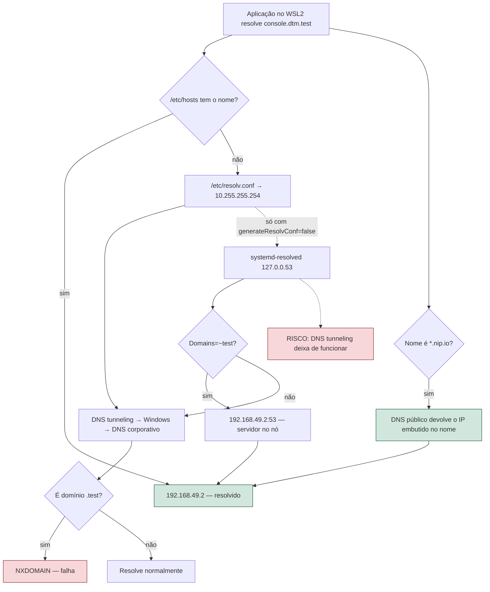

# Resolução de nomes para o minikube em WSL2 — por que o `ingress-dns` não serve

| Campo | Valor |
|---|---|
| Versão | 1.1 |
| Data | 2026-09-09 |
| Status | Concluída. **Acesso por nome descartado** por decisão do usuário em 2026-09-09; ver §13.1 |
| Escopo | Acesso por nome estável aos serviços da POC a partir do host WSL2, sem `port-forward` |
| Fora de escopo | Acesso a partir do Windows, TLS, resolução em produção |
| Ambiente medido | minikube 1.36.0 (driver docker), Kubernetes 1.33.3, WSL 2.3.26.0, Ubuntu 24.04, fish 3.7 |
| Task de origem | T1.8, parte B ([TODO.md](TODO.md)) |
| Máquina | `N-DWBS344`, domínio corporativo `paranoa.com.br` |

---

## Sumário

1. [Como usar este documento](#1-como-usar-este-documento)
2. [Glossário](#2-glossário)
3. [Problema, premissas e escopo](#3-problema-premissas-e-escopo)
4. [Fundamentos: o problema tem duas metades](#4-fundamentos-o-problema-tem-duas-metades)
5. [O addon oficial: a imagem não existe mais](#5-o-addon-oficial-a-imagem-não-existe-mais)
6. [A imagem substituta: incompatível com Kubernetes ≥ 1.22](#6-a-imagem-substituta-incompatível-com-kubernetes--122)
7. [O caminho de rede sempre funcionou](#7-o-caminho-de-rede-sempre-funcionou)
8. [O lado do host: WSL2 em modo `foreign`](#8-o-lado-do-host-wsl2-em-modo-foreign)
9. [`/etc/hosts`: a objeção que não se confirmou](#9-etchosts-a-objeção-que-não-se-confirmou)
10. [Prova ponta a ponta pelo Ingress](#10-prova-ponta-a-ponta-pelo-ingress)
11. [Fluxo de resolução](#11-fluxo-de-resolução)
12. [Runbook de diagnóstico](#12-runbook-de-diagnóstico)
13. [Alternativas comparadas](#13-alternativas-comparadas) — e a [decisão tomada](#131-decisão-tomada--nenhuma-das-opções-acima)
14. [Riscos e limitações](#14-riscos-e-limitações)
15. [Checklists](#15-checklists)
16. [Anexos](#16-anexos)
17. [Resumo executivo](#17-resumo-executivo)
18. [Referências](#18-referências)
19. [Manutenção](#19-manutenção)

---

## 1. Como usar este documento

| Papel | Leia, nesta ordem |
|---|---|
| Quem vai decidir a parte B da T1.8 | §17 → §13 → §14 |
| Quem for implementar | §13 → §16 → §15 |
| Quem tentar reabilitar o `ingress-dns` no futuro | §5 → §6 → §12 |
| Quem só quer os nomes funcionando agora | §17, item 5 |

> **A seção mais importante é a §4.** Ela nomeia o modo de falha dominante deste tema: gastar esforço
> na metade barata do problema (o servidor DNS dentro do cluster) acreditando que ela entrega
> resolução de nome para o host. Não entrega. Toda a dificuldade real está na outra metade.

---

## 2. Glossário

| Termo | Significado |
|---|---|
| **A record** | Registro DNS que mapeia um nome para um endereço IPv4 |
| **Addon** | Componente opcional que o minikube instala com `minikube addons enable` |
| **CoreDNS** | Servidor DNS usado como DNS interno padrão do Kubernetes |
| **DNS tunneling** | Recurso do WSL2 que atende consultas DNS via o host Windows, em `10.255.255.254` |
| **dnsmasq** | Servidor DNS leve, comum como resolvedor local com encaminhamento por domínio |
| **GCR** | Google Container Registry — registry onde o minikube publica suas imagens |
| **hostNetwork** | Pod que usa a pilha de rede do nó, sem IP próprio |
| **hostPort** | Porta do nó publicada diretamente por um container |
| **Ingress** | Recurso do Kubernetes que roteia HTTP por nome de host |
| **NXDOMAIN** | Resposta DNS indicando que o nome não existe |
| **rcode** | Código de retorno de uma resposta DNS (`0` = sucesso) |
| **RFC 6761** | Norma que reserva `.test`, `.example`, `.invalid` e `.localhost` para uso local |
| **SA** | ServiceAccount — identidade de um pod perante o apiserver |
| **stub resolver** | Ouvinte local do systemd-resolved, em `127.0.0.53` |
| **systemd-resolved** | Serviço de resolução de nomes do systemd |
| **WSL2** | Windows Subsystem for Linux, versão 2 |

---

## 3. Problema, premissas e escopo

### 3.1 O problema

Os seis serviços da POC (MinIO console, MinIO S3, Airflow, ClickHouse, PostgreSQL, MongoDB) só são
alcançáveis por `kubectl port-forward`, que morre junto com o terminal, ou por NodePort no IP do nó,
que pode mudar ao recriar o cluster. O objetivo da T1.8 parte B é acesso por **nome estável**,
sobrevivendo a `minikube delete` seguido de `bootstrap.sh`.

O `ingress-dns` é o addon que o minikube oferece exatamente para isso: um servidor DNS dentro do
cluster que lê os recursos Ingress e responde os nomes deles com o IP do nó. Esta pesquisa apurou se
ele é utilizável neste ambiente.

### 3.2 Premissas assumidas

| Premissa | Base |
|---|---|
| O IP do nó pode ser fixado em `192.168.49.2` | `--subnet` é suportado no driver docker; a rede atual já é `192.168.49.0/24` |
| Só o host WSL2 precisa resolver os nomes | Decisão de escopo da T1.8; do Windows continua `port-forward` |
| Alterar DNS corporativo é custo inaceitável | Máquina corporativa, resolução de `paranoa.com.br` é requisito de trabalho |
| `sudo` exige senha | Medido: `sudo -n true` falha |

### 3.3 Fora de escopo

- Acesso a partir do Windows — a rede `192.168.49.0/24` vive dentro do WSL2 e não é roteável de fora.
- TLS. Ambiente local descartável; certificado só acrescentaria passo de confiança no navegador.
- Resolução de nomes em produção. Nada aqui se aplica ao cluster produtivo.

---

## 4. Fundamentos: o problema tem duas metades

Resolver um nome como `console.dtm.test` a partir do WSL2 exige **duas** peças independentes:

| Metade | O que faz | Custo real |
|---|---|---|
| **A — servidor** | Alguém precisa saber responder `console.dtm.test → 192.168.49.2` | Baixo. Resolvido em ~30 linhas de YAML (§7) |
| **B — encaminhamento** | O resolvedor do WSL2 precisa **enviar a consulta** para esse alguém | Alto. É onde o WSL2 impõe as restrições (§8) |

O `ingress-dns` implementa **apenas a metade A**. A documentação oficial do minikube deixa isso
explícito ao exigir, como passo separado, um drop-in de `systemd-resolved`, uma configuração de
`NetworkManager` ou de `resolvconf` — a metade B, delegada ao usuário.

> **Modo de falha dominante:** concluir que "o `ingress-dns` está funcionando" porque o pod está
> `Running`, e depois passar horas investigando firewall, `iptables` e rota, quando o que falta é a
> metade B — ou, como aconteceu aqui, quando a metade A está silenciosamente morta.

Consequência prática: consertar o `ingress-dns` **não** encurta o caminho. A metade B continua
intacta, e é ela que decide se a solução é viável nesta máquina.

---

## 5. O addon oficial: a imagem não existe mais

`minikube addons enable ingress-dns` habilita o addon, mas o pod nunca sobe:

```
Failed to pull image "gcr.io/k8s-minikube/minikube-ingress-dns:0.0.3":
manifest for gcr.io/k8s-minikube/minikube-ingress-dns:0.0.3 not found: manifest unknown
```

Confirmado também com `docker pull` direto do host: a listagem de tags do repositório volta vazia.

O estado upstream, apurado nas issues:

| Issue | Conteúdo | Status |
|---|---|---|
| [#22588](https://github.com/kubernetes/minikube/issues/22588) | `gcr.io/k8s-minikube/us/minikube-ingress-dns` está vazio; **minikube 1.38 continua quebrado** | Fechada como *not planned*, label `lifecycle/rotten` |
| [#20629](https://github.com/kubernetes/minikube/issues/20629) | O addon referencia duas imagens diferentes entre si | Aberta |

> **Não adianta esperar a próxima versão do minikube.** A issue foi fechada sem plano de correção e o
> relato mais recente confirma a falha duas versões adiante da nossa. O componente está abandonado.

---

## 6. A imagem substituta: incompatível com Kubernetes ≥ 1.22

A imagem do projeto original (`cryptexlabs/minikube-ingress-dns:0.3.0`, de 2020) foi injetada no
Deployment do addon como substituta. O pod passou a `Running`, com o log correto:

```
Listening to 192.168.49.2 on port 53
```

`ss -lunp` no nó confirmou o socket UDP em `192.168.49.2:53`, e `hostNetwork: true` no spec. Ainda
assim, as consultas pareciam expirar. **Não expiravam.** O log do container anterior mostra o que
realmente acontece:

```
Listening to 192.168.49.2 on port 53
{"header":{...},"questions":[{"name":"teste.dtm.test","type":1,"class":1}],"answers":[]}
undefined:1
404 page not found
    ^
SyntaxError: Unexpected token p in JSON at position 4
    at JSON.parse (<anonymous>)
    at Request._callback (/var/app/src/index.js:33:27)
error Command failed with exit code 1.
```

Leitura linha a linha: a consulta **chegou** ao servidor; ele perguntou ao apiserver quais Ingress
existem; recebeu `404 page not found` em texto puro; tentou `JSON.parse` naquilo; e o processo morreu.
Os **3 restarts** contabilizados no pod correspondem exatamente às 3 consultas feitas.

A causa do 404 é de versão de API, não de permissão:

```
kubectl version                                 → Server v1.33.3
kubectl api-resources --api-group=extensions    → (vazio)
kubectl api-resources --api-group=networking.k8s.io → ingresses  networking.k8s.io/v1
```

A imagem de 2020 consulta `/apis/extensions/v1beta1/ingresses`. O `Ingress` saiu de `extensions/v1beta1`
no Kubernetes 1.22; o grupo `extensions` hoje não expõe recurso nenhum. O RBAC do addon até concede o
grupo (`apiGroups: ["", "extensions", "networking.k8s.io"]`), o que reforça o diagnóstico: a permissão
está lá, o **endpoint** é que não.

| Camada | Estado |
|---|---|
| Imagem oficial `0.0.3` | Não existe no registry |
| Imagem alternativa `0.3.0` | Existe, sobe, e morre na primeira consulta |
| Rede entre host e nó | Íntegra (§7) |

---

## 7. O caminho de rede sempre funcionou

Para separar "servidor quebrado" de "rede bloqueada", subi um CoreDNS próprio no nó, em porta
alternativa (`5353/UDP`), com o plugin `template` respondendo qualquer `*.dtm.test`. A imagem
`registry.k8s.io/coredns/coredns:v1.12.0` **já está no cache do minikube** — não houve pull.

Consultas emitidas do host WSL2, direto ao `192.168.49.2:5353`:

| Nome consultado | Resultado |
|---|---|
| `console.dtm.test` | `rcode=0 ancount=1 answers=['192.168.49.2']` |
| `airflow.dtm.test` | `rcode=0 ancount=1 answers=['192.168.49.2']` |
| `qualquer.coisa.dtm.test` | `rcode=0 ancount=1 answers=['192.168.49.2']` |

Conclusões diretas:

1. Não há firewall, `iptables` ou rota impedindo DNS entre o host WSL2 e o nó minikube.
2. O wildcard funciona — inclusive para nomes que não existem em Ingress nenhum.
3. A metade A é substituível por ~30 linhas de YAML (Anexo A), sem depender de registry de terceiro
   nem de componente abandonado.

O YAML completo está no Anexo A. Ele resolve a metade A **melhor** que o addon: sem dependência
externa, com imagem já presente e com configuração legível.

---

## 8. O lado do host: WSL2 em modo `foreign`

Aqui está o custo real. Estado medido:

```
/etc/wsl.conf          → [boot] systemd=true          (nada de [network])
/etc/resolv.conf       → symlink para /mnt/wsl/resolv.conf
                         nameserver 10.255.255.254
                         search paranoa.com.br
resolvectl status      → resolv.conf mode: foreign
                         Current DNS Server: 10.255.255.254
ip route get 10.255.255.254 → local ... dev lo   (DNS tunneling ativo)
```

O `10.255.255.254` é o endereço do **DNS tunneling** do WSL2: as consultas são atendidas pelo host
Windows, que é quem enxerga o DNS corporativo.

Um detalhe importante e contraintuitivo:

```
ss -lunp | grep 127.0.0.5     → 127.0.0.53:53 e 127.0.0.54:53 escutando
consulta a 127.0.0.53 por github.com → rcode=0 ancount=1 answers=['4.228.31.150']
```

**O systemd-resolved está rodando e funciona perfeitamente.** O modo `foreign` significa apenas que
`/etc/resolv.conf` não aponta para ele: as aplicações vão direto ao `10.255.255.254` e o resolved fica
fora do caminho. Por isso o drop-in `Domains=~test` recomendado pela documentação do minikube não teria
efeito nenhum aqui — ele configuraria um serviço que ninguém consulta.

Para tirar do modo `foreign` seria preciso `generateResolvConf = false` em `/etc/wsl.conf`, e é aí que
o custo aparece:

> **Há relato consistente de que `generateResolvConf = false` impede o DNS tunneling de funcionar** —
> exatamente o mecanismo que faz `paranoa.com.br` resolver nesta máquina. Trocar resolução de nome
> corporativa por conveniência de POC é um péssimo negócio, e o mesmo raciocínio se aplica a instalar
> `dnsmasq` como resolvedor primário, que exige a mesma alteração.

Some-se que `sudo` exige senha aqui (`sudo -n true` falha): qualquer caminho da metade B é execução
manual do usuário, não automatizável no `bootstrap.sh`.

| Caminho para a metade B | Exige | Risco |
|---|---|---|
| Drop-in do systemd-resolved | `generateResolvConf=false` + `wsl --shutdown` | Quebra DNS corporativo |
| `dnsmasq` em `127.0.0.1` | mesma alteração + pacote novo (2.91 disponível) | Idêntico |
| `/etc/hosts` | `sudo` uma vez por nome novo | Nenhum |
| `nip.io` / `sslip.io` | nada | Depende de DNS público |

---

## 9. `/etc/hosts`: a objeção que não se confirmou

O planejamento original descartava `/etc/hosts` sob o argumento de que o WSL reescreve o arquivo a cada
inicialização, apagando as entradas. **A medição não sustenta isso:**

```
/etc/hosts             mtime  2026-07-27 07:24:23
/mnt/wsl/resolv.conf   mtime  2026-07-27 07:24:22
uptime -s                     2026-08-16 17:23:04
```

Ambos os arquivos são três semanas mais velhos que a inicialização atual. O WSL não os tocou neste
boot. O cabeçalho dos arquivos anuncia a geração automática e as chaves `generateHosts` /
`generateResolvConf`, mas na prática a reescrita não ocorreu — edição manual persiste.

Um detalhe correlato, medido: `/etc/hosts` **não** contém as entradas do arquivo `hosts` do Windows.
A herança que se costuma supor entre Windows e WSL não existe neste ambiente, o que também descarta
editar o lado Windows como atalho.

Limitação que permanece: `/etc/hosts` não faz wildcard. Cada nome novo é uma linha nova e um `sudo`.

---

## 10. Prova ponta a ponta pelo Ingress

Com Ingress reais apontando para os serviços reais da POC:

| Requisição | Resolução | Resposta |
|---|---|---|
| `http://console.192.168.49.2.nip.io/` | DNS público, sem config | **200** |
| `http://airflow.192.168.49.2.nip.io/` | DNS público, sem config | **302** (redirect de login) |
| `http://console.dtm.test/` | `curl --resolve` (simula `/etc/hosts`) | **200** |
| `http://192.168.49.2/` | IP direto | **404** (backend padrão do nginx) |

Três fatos que isso estabelece:

1. O addon `ingress` publica 80/443 por `hostPort` no nó — `http://192.168.49.2` responde **sem**
   `minikube tunnel`. A premissa B2 do plano da T1.8 está confirmada.
2. `nip.io` e `sslip.io` resolvem nesta rede corporativa, e com o `--subnet` fixo os nomes são estáveis
   para sempre.
3. O `Service` do MinIO é headless (`clusterIP: None`) e o nginx roteou corretamente mesmo assim —
   não foi preciso criar Service auxiliar para os alvos HTTP.

---

## 11. Fluxo de resolução



| Fase | Saída persistida | Critério de avanço |
|---|---|---|
| IP determinístico | `--subnet=192.168.49.0/24` no `minikube-up.sh` | `minikube ip` = `192.168.49.2` após recriar |
| Ingress publicado | `infra/ingress/ingress-http.yaml` | `curl -sI http://192.168.49.2` responde 404 do nginx |
| Nome resolvendo | nenhuma (nip.io) ou `/etc/hosts` | `curl -sI http://console.<...>` responde 200 |

---

## 12. Runbook de diagnóstico

| Sintoma | Causa provável | Como investigar |
|---|---|---|
| Pod do `ingress-dns` em `ImagePullBackOff` | Imagem removida do GCR (§5) | `kubectl -n kube-system describe pod kube-ingress-dns-minikube` |
| Consulta DNS "expira" mas o pod está `Running` | O servidor caiu **ao processar** a consulta | `kubectl -n kube-system logs kube-ingress-dns-minikube --previous` |
| `404 page not found` no log do servidor DNS | Imagem usa grupo de API removido (§6) | `kubectl api-resources --api-group=extensions` — se vazio, confirmado |
| Drop-in do resolved não surte efeito | `resolv.conf mode: foreign` (§8) | `resolvectl status \| head -3` |
| Nome resolve mas HTTP dá 404 | Falta Ingress para aquele host | `kubectl get ingress -A` |
| Nome resolve, HTTP dá 502/503 | Backend fora do ar | `kubectl -n <ns> get endpoints <svc>` |
| Tudo quebra após recriar o cluster | `--subnet` não pegou; IP mudou | `minikube ip` |
| Upload grande de Parquet dá 413 | Falta `proxy-body-size: 0` no Ingress do S3 | `kubectl -n datamart get ingress -o yaml` |

Para consultar um servidor DNS específico sem `dig` nem `nslookup` (nenhum dos dois está instalado
neste ambiente), use o script do Anexo B.

---

## 13. Alternativas comparadas

| Abordagem | Wildcard | Config no host | Dependência externa | Quando considerar | Limitação |
|---|---|---|---|---|---|
| **`nip.io` / `sslip.io`** | por construção | **nenhuma** | DNS público | Padrão. Funciona no minuto zero | Nome longo; morre offline |
| **`/etc/hosts` via script** | não | `sudo`, uma vez por nome | nenhuma | Rede de segurança e uso offline | Um `sudo` por nome novo |
| **CoreDNS próprio no nó** | sim | drop-in no resolved | nenhuma | Só se aceitar mexer no resolver | Exige `generateResolvConf=false` |
| **`dnsmasq` local** | sim | `resolv.conf` + pacote | nenhuma | Equivalente ao anterior, mais peça | Mesmo risco, superfície maior |
| **addon `ingress-dns`** | — | — | imagem inexistente | **Nunca** | Abandonado upstream (§5) |
| **`port-forward`** | — | nenhuma | nenhuma | Emergência e acesso do Windows | Morre com o terminal |

**Recomendação original desta pesquisa:** `nip.io` como caminho primário e `/etc/hosts` como rede de
segurança, com **ambos os nomes no mesmo Ingress**. O `nip.io` entrega o requisito da T1.8 sem custo e sem `sudo`; o `.dtm.test`
fica pronto no recurso e passa a resolver assim que o usuário rodar o script de `hosts`, cobrindo
trabalho offline ou bloqueio futuro do `nip.io`. O CoreDNS próprio vai documentado como caminho
opcional, não aplicado.

### 13.1 Decisão tomada — nenhuma das opções acima

Em 2026-09-09 o usuário descartou a linha inteira de acesso por nome: **o custo de implementação não paga
o benefício.** Três fatos da pesquisa sustentam a escolha:

| Fato | Peso na decisão |
|---|---|
| O `nip.io` só resolve HTTP com Ingress | PostgreSQL e MongoDB continuariam dependendo de encaminhamento — a solução cobriria 4 dos 6 serviços |
| O `.dtm.test` exige `sudo` a cada nome novo | E `sudo` pede senha aqui, então nunca entra no `bootstrap.sh` |
| Wildcard de verdade exige mexer no resolvedor | Risco à resolução corporativa, desproporcional para uma POC |

Entrou no lugar `scripts/ports.sh`: um gerenciador de `port-forward` com supervisor por porta, que reabre
o encaminhamento sozinho quando a conexão cai. Cobre **os sete** acessos com uma peça só, não precisa de
`sudo`, não depende de DNS público e não toca em nada do WSL. Ver
[epicos/E1-infraestrutura.md](epicos/E1-infraestrutura.md) T1.8.

O que se perde, declarado: as URLs são `localhost:<porta>` em vez de nomes; é preciso rodar um comando
por sessão de trabalho (uma vez, não a cada serviço); e portas locais podem colidir com serviços
instalados na máquina — o script detecta e avisa, mas não resolve sozinho.

Esta pesquisa continua válida como registro: se o `ingress-dns` voltar a ser publicado, ou se a máquina
deixar de ser corporativa, as §5 a §9 dizem exatamente o que funciona e o que não.

---

## 14. Riscos e limitações

| Risco | Natureza | Mitigação |
|---|---|---|
| `nip.io` indisponível ou bloqueado | Externo, fora do nosso controle | Os mesmos serviços já respondem por `.dtm.test`; basta rodar o script de `hosts` |
| Sem internet, `nip.io` não resolve | Estrutural | Idem |
| IP do nó mudar | Configuração | `--subnet=192.168.49.0/24`; o script de `hosts` avisa se `minikube ip` divergir |
| WSL reescrever `/etc/hosts` | Baixo, não observado em 6 semanas (§9) | Rodar o script de novo; é idempotente |
| Mexer no resolver quebrar DNS corporativo | Alto, se escolhido | Não escolher. Documentado como opcional |
| Alguém reabilitar o `ingress-dns` | Perda de tempo | §5 e §6 deste documento; §12 dá o diagnóstico em 2 comandos |

### 14.1 O que esta solução NÃO resolve

- **Acesso a partir do Windows.** A rede `192.168.49.0/24` vive dentro do WSL2 e não é roteável de fora.
  Do Windows continua sendo `port-forward`.
- **Descoberta automática de host novo pelo `.dtm.test`.** Acrescentar serviço exige rodar o script de
  `hosts` de novo. Pelo `nip.io` é automático — é a vantagem concreta dele.
- **TLS.** Tudo em HTTP simples.
- **Isolamento entre tenants no acesso.** Os nomes são de conveniência; não substituem o RBAC.
- **Nada disso é modelo para produção.** É ferramenta de desenvolvimento local.

---

## 15. Checklists

### 15.1 Pré-implementação

- [ ] `--subnet=192.168.49.0/24` presente no `cluster/minikube-up.sh`
- [ ] Addon `ingress` habilitado no `minikube-up.sh`
- [ ] Addon `ingress-dns` **não** habilitado
- [ ] Hosts `nip.io` e `.dtm.test` declarados no mesmo Ingress
- [ ] `proxy-body-size: 0` no Ingress do endpoint S3
- [ ] Annotation de WebSocket no Ingress do console do MinIO

### 15.2 Go/No-Go da parte B da T1.8

- [ ] `minikube ip` devolve `192.168.49.2`
- [ ] `curl -sI http://192.168.49.2` devolve 404 do nginx (sem `tunnel`)
- [ ] Os quatro serviços HTTP respondem por `nip.io`
- [ ] `minikube delete` + `bootstrap.sh` e os nomes voltam a responder **sem tocar em nada**
- [ ] Script de `hosts` é idempotente e tem `--check` e `--remove`
- [ ] `bootstrap.sh` avisa, mas **não falha**, se o bloco do `/etc/hosts` estiver ausente

### 15.3 Pós-implementação

- [ ] `docs/TROUBLESHOOTING.md` referencia este documento
- [ ] `docs/TESTES.md` cobre o ciclo `delete` + `bootstrap` como caso de teste
- [ ] `scripts/minio-ui.sh` imprime a URL do Ingress antes da opção de `port-forward`

---

## 16. Anexos

### Anexo A — CoreDNS wildcard no nó (substituto do `ingress-dns`)

Aplicado e verificado nesta pesquisa, em porta `5353` para não conflitar. **Para uso real, troque
`5353` por `53` nos três lugares** e garanta que nada mais ocupe a porta 53 do nó.

```yaml
apiVersion: v1
kind: ConfigMap
metadata:
  name: dns-wildcard
  namespace: datamart
data:
  Corefile: |
    dtm.test:5353 {
        template IN A dtm.test {
            match "^.*\.dtm\.test\.$"
            answer "{{ .Name }} 60 IN A 192.168.49.2"
            fallthrough
        }
        log
        errors
    }
---
apiVersion: apps/v1
kind: Deployment
metadata:
  name: dns-wildcard
  namespace: datamart
spec:
  replicas: 1
  selector:
    matchLabels: {app: dns-wildcard}
  template:
    metadata:
      labels: {app: dns-wildcard}
    spec:
      hostNetwork: true
      dnsPolicy: ClusterFirstWithHostNet
      containers:
        - name: coredns
          image: registry.k8s.io/coredns/coredns:v1.12.0
          args: ["-conf", "/etc/coredns/Corefile"]
          ports:
            - {containerPort: 5353, hostPort: 5353, protocol: UDP}
          volumeMounts:
            - {name: cfg, mountPath: /etc/coredns}
          resources:
            requests: {cpu: "10m", memory: "32Mi"}
            limits: {cpu: "200m", memory: "128Mi"}
      volumes:
        - name: cfg
          configMap: {name: dns-wildcard}
```

Armadilhas deste YAML:

- O IP em `answer` é **literal**. Se o `--subnet` mudar, este arquivo precisa mudar junto.
- `hostNetwork: true` exige `dnsPolicy: ClusterFirstWithHostNet`; sem isso o próprio CoreDNS perde
  acesso ao DNS do cluster.
- Este servidor responde qualquer `*.dtm.test`, inclusive nomes sem Ingress. É wildcard cego, não
  descoberta — diferente do `ingress-dns`, que lia os Ingress de verdade.

### Anexo B — Consulta DNS sem `dig` nem `nslookup`

Nenhum dos dois está instalado neste ambiente. Este script consulta um servidor e porta específicos:

```python
import socket, struct, sys, random
host, port, name = sys.argv[1], int(sys.argv[2]), sys.argv[3]
q = struct.pack(">HHHHHH", random.randint(0, 65535), 0x0100, 1, 0, 0, 0)
for lbl in name.split("."):
    q += bytes([len(lbl)]) + lbl.encode()
q += b"\x00" + struct.pack(">HH", 1, 1)
s = socket.socket(socket.AF_INET, socket.SOCK_DGRAM); s.settimeout(4)
try:
    s.sendto(q, (host, port)); data, _ = s.recvfrom(2048)
except socket.timeout:
    print(f"TIMEOUT consultando {host}:{port} por {name}"); sys.exit(1)
rcode, ancount = data[3] & 0x0F, struct.unpack(">H", data[6:8])[0]
i = 12
while data[i] != 0: i += 1 + data[i]
i += 5
ips = []
for _ in range(ancount):
    if data[i] & 0xC0 == 0xC0: i += 2
    else:
        while data[i] != 0: i += 1 + data[i]
        i += 1
    typ, _c, _t, rdl = struct.unpack(">HHIH", data[i:i+10]); i += 10
    if typ == 1: ips.append(".".join(str(b) for b in data[i:i+4]))
    i += rdl
print(f"rcode={rcode} ancount={ancount} answers={ips}")
```

Uso: `python3 dnsq.py 192.168.49.2 5353 console.dtm.test`

Só trata registro `A` e resposta em um único datagrama UDP — suficiente para diagnóstico local, não é
substituto de `dig`.

### Anexo C — Caminho opcional do resolver (NÃO aplicado)

Só faz sentido se a metade B por wildcard virar requisito. **Executar por conta e risco:** a primeira
alteração é a que ameaça o DNS corporativo.

```
# 1. /etc/wsl.conf
[network]
generateResolvConf = false

# 2. no PowerShell do Windows
wsl --shutdown

# 3. de volta no WSL, apontar para o stub do resolved
sudo ln -sf /run/systemd/resolve/stub-resolv.conf /etc/resolv.conf

# 4. encaminhar só .test para o nó
sudo mkdir -p /etc/systemd/resolved.conf.d
printf '[Resolve]\nDNS=192.168.49.2\nDomains=~test\n' \
  | sudo tee /etc/systemd/resolved.conf.d/minikube.conf
sudo systemctl restart systemd-resolved
```

Verificação obrigatória **antes** de considerar concluído — se a primeira falhar, reverta o passo 1:

```
resolvectl query www.paranoa.com.br     # DNS corporativo ainda funciona?
resolvectl query console.dtm.test       # deve devolver 192.168.49.2
```

Reversão: apagar `/etc/systemd/resolved.conf.d/minikube.conf`, remover o bloco `[network]` do
`/etc/wsl.conf` e rodar `wsl --shutdown` de novo.

---

## 17. Resumo executivo

1. **O addon `ingress-dns` do minikube está morto.** A imagem `gcr.io/k8s-minikube/minikube-ingress-dns:0.0.3`
   não existe mais no registry, a issue foi fechada como *not planned* e o problema persiste no
   minikube 1.38.
2. **A imagem substituta da comunidade é incompatível com o cluster.** Ela consulta
   `extensions/v1beta1/ingresses`, grupo removido no Kubernetes 1.22; o cluster está em 1.33.3. O
   servidor recebe a consulta, leva `404`, quebra no `JSON.parse` e morre — o que parecia timeout era
   crash na primeira pergunta.
3. **A rede nunca foi o problema.** Um CoreDNS próprio no nó respondeu wildcard `*.dtm.test` para o
   host WSL2 com `rcode=0`. A metade "servidor" custa ~30 linhas de YAML e imagem já presente.
4. **O custo real está no resolvedor do WSL2.** O `resolv.conf` aponta direto para o DNS tunneling
   (`10.255.255.254`) em modo `foreign`; o systemd-resolved funciona mas está fora do caminho. Colocá-lo
   no caminho exige `generateResolvConf=false`, com risco relatado de quebrar a resolução corporativa —
   e `sudo` aqui pede senha, então nada disso é automatizável.
5. **A recomendação é `nip.io` como primário e `/etc/hosts` como rede de segurança**, os dois nomes no
   mesmo Ingress. Já verificado ponta a ponta: MinIO console **200** e Airflow **302** por
   `nip.io`, sem nenhuma configuração de host.
6. **Decisão tomada: nada disso foi implementado.** O usuário descartou o acesso por nome — o `nip.io`
   cobriria só os 4 serviços HTTP, o `.dtm.test` exigiria `sudo` a cada nome, e o wildcard real ameaçaria
   o DNS corporativo. Entrou `scripts/ports.sh`, que cobre os 7 acessos com uma peça só (§13.1).
7. **Uma objeção do planejamento original caiu.** O WSL **não** reescreveu `/etc/hosts` neste ambiente —
   o arquivo é três semanas mais velho que a inicialização atual. `/etc/hosts` é bem mais durável do
   que se supunha.

---

## 18. Referências

**Estado do addon no upstream**
- [minikube #22588 — Ingress-DNS Addon Image Missing](https://github.com/kubernetes/minikube/issues/22588)
- [minikube #20629 — addon usando duas imagens diferentes](https://github.com/kubernetes/minikube/issues/20629)
- [Ingress DNS — documentação oficial do minikube](https://minikube.sigs.k8s.io/docs/handbook/addons/ingress-dns/)

**CoreDNS**
- [Plugin `template`](https://github.com/coredns/coredns/tree/master/plugin/template)
- [CoreDNS for Minikube](https://coredns.io/2017/04/28/coredns-for-minikube/)
- [DNS for local Kubernetes Ingress](https://pnguyen.au/posts/dns-for-local-kubernetes-ingress/)

**DNS no WSL2**
- [Windows 11 WSL2 DNS and OpenVPN Split Tunnel](https://copdips.com/2026/03/windows-11-wsl2-dns-and-openvpn-split-tunnel.html)
- [Fix WSL2 DNS Issues: Browsers vs CLI on Corporate VPNs](https://www.techrbun.com/solve-wsl2-dns-issues-browsers-vs-cli-on-corporate-vpns/)

**Normas**
- [RFC 6761 — Special-Use Domain Names](https://www.rfc-editor.org/rfc/rfc6761) (reserva de `.test`)

---

## 19. Manutenção

Arquivo: `docs/pesquisa-ingress-dns-wsl2.md`. Referenciado por `docs/TROUBLESHOOTING.md` e pela T1.8 em
`docs/TODO.md`.

Incrementar a versão quando: o minikube voltar a publicar a imagem do `ingress-dns`; a subnet do
cluster mudar (invalida o IP literal em §7, §11 e no Anexo A); o modo do `resolv.conf` deixar de ser
`foreign`; ou a recomendação da §13 for substituída.
